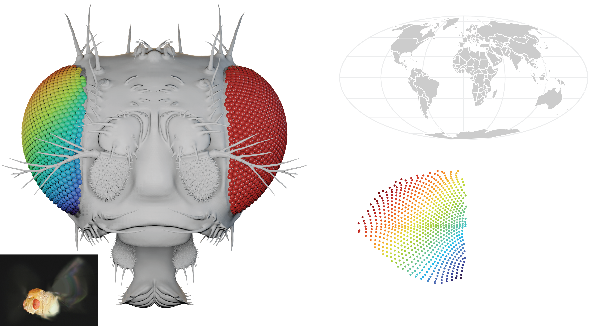
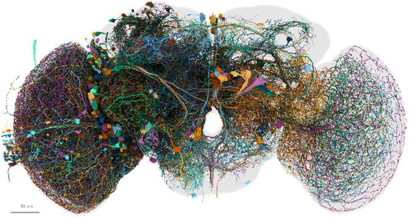
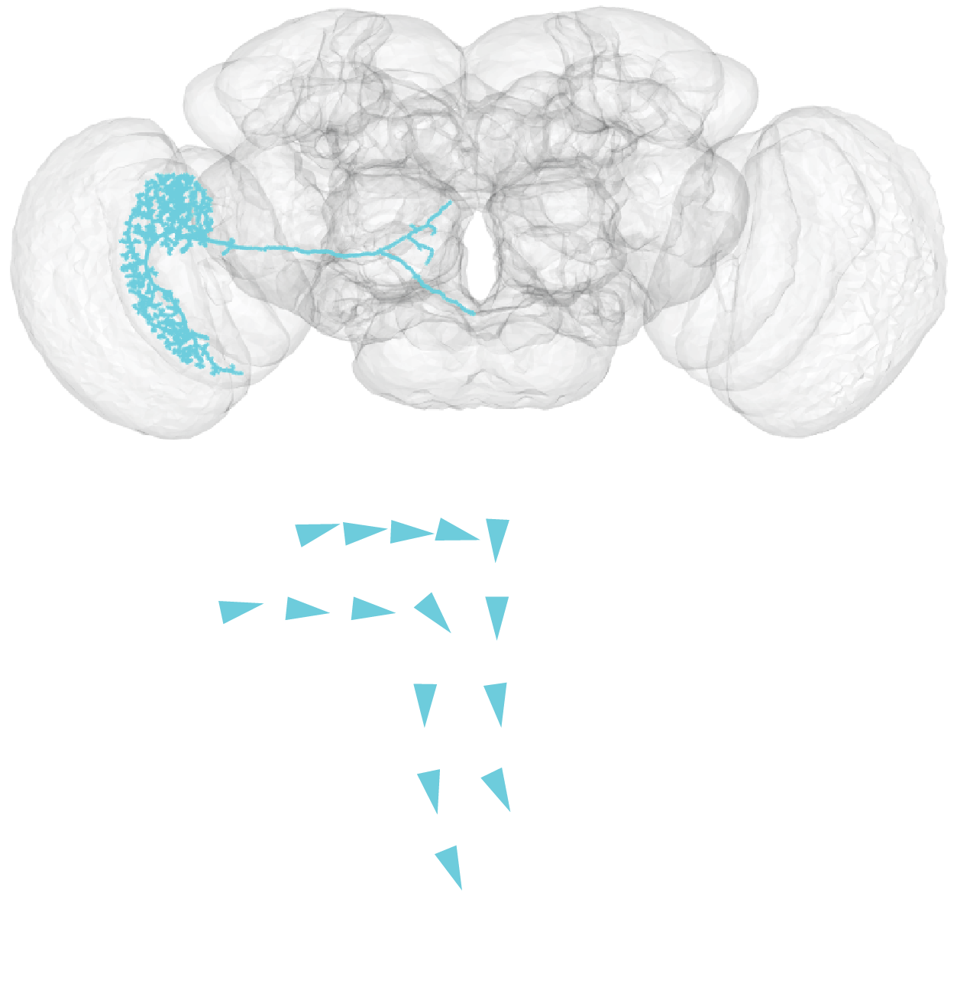

# What does a brain really see?

Many animals rely on vision to move through the world, find food, and interact with others. **_How does the brain transform the light striking the retina into visual perception?_** In our lab, we use computational tools and cellular-resolution brain maps to understand how these transformations happen at the level of single neurons.

## The view from a fly's cockpit

To understand how a brain encodes visual perception, we first ask what visual signals are available to it. Our favorite animal to study is the fruit fly (_Drosophila melanogaster_), an amazing flyer with signature red compound eyes, each made up of hundreds of facet lenses. What a fly can see depends on the geometry of its eyes. Using X-ray scans, we build an _eyemap_ &mdash; the viewing direction of every facet of the compound eye (left) &mdash; and plot these directions (3D vectors) on the same kind of projection a cartographer uses to flatten the globe (right, color-matched).



Vision evolved to guide behavior, so what an animal sees also depends on how it moves. With the eyemap, we can simulate visual input in a virtual environment. This animation shows a virtual fly moving through a naturalistic landscape, with the scene rendered as its compound eyes actually sample it &mdash; coarse, nearly panoramic, and uneven across the visual field &mdash; rather than as a camera would.

<!-- One pre-stacked video, side by side, so the three views can never drift
     out of sync. The eye clips are 10 s long and start 2 s before the
     bird's-eye clip, hence --start 2; the compound-eye view is cropped to its
     ellipse. The source clips live in local/ (never published);
     rebuild images/sim_hstack.{mp4,webm} from them with:
       python scripts/stack_videos.py --direction h --size 400
           -i birdseye.mp4
           -i panoramic_eye.mp4 --start 2
           -i compound_eye.mp4 --start 2 --crop 400:206:0:97
           -o sim_hstack
     WebM (VP9) comes first because some embedded browsers, e.g. VS Code's
     preview panel, cannot decode the H.264 in the MP4; the MP4 is the fallback.
     The WebM MUST use limited ("tv") colour range: GPU VP9 decoders reject
     full-range streams with a decode error, which freezes the video on its
     first frame. The script always encodes limited range. -->
```{=html}
<figure class="sim-video">
  <video id="sim-video" autoplay muted loop playsinline preload="auto"
         aria-label="Simulated fly shown from a bird's-eye view, a panoramic view, and through its compound eye">
    <source src="images/sim_hstack.webm" type='video/webm; codecs="vp9"'>
    <source src="images/sim_hstack.mp4" type='video/mp4; codecs="avc1.64001F"'>
  </video>
  <figcaption>Left to right: bird's-eye view, panoramic view, and compound-eye view.</figcaption>
</figure>
<script>
  (function () {
    var v = document.getElementById("sim-video");
    var mp4 = "images/sim_hstack.mp4";

    // A decode error part-way through (as opposed to an unsupported format)
    // does not make the browser try the next <source>, so switch to the MP4
    // by hand rather than leave a frozen frame.
    v.addEventListener("error", function () {
      if (v.currentSrc.indexOf(".webm") === -1) return;
      v.src = mp4;
      start();
    });

    // If the browser refuses to autoplay (e.g. autoplay blocked in its
    // settings, or a phone in low-power mode), show the controls so the video
    // isn't a frozen first frame, and start it on the visitor's first tap,
    // click, or key press anywhere on the page.
    var events = ["pointerdown", "touchstart", "keydown"];
    function retry() {
      events.forEach(function (e) { document.removeEventListener(e, retry); });
      v.play().catch(function () {});
    }
    function start() {
      var p = v.play();
      if (p && p.catch) p.catch(function () {
        v.controls = true;
        events.forEach(function (e) { document.addEventListener(e, retry); });
      });
    }
    start();
  })();
</script>
```

## Map the world into the brain

::: {.float-section}
::: {.float-fig-left}

:::

Behind each eye facet sits a bundle of photoreceptors, which convert light into neural signals and pass them on to columnar neurons in the optic lobe (the fly brain's visual center). This columnar arrangement preserves neighbor relationships, so each layered region, from the retina down to the lobula plate (many intermediate layers are not shown here), holds a map of visual space.

But how can we use this map to study the properties of individual neurons? Here lies another privilege of working with fruit flies: electron microscopy (EM) connectomes, which contain every neuron and synapse in the brain. The image below shows a sample of visual neurons originating from one optic lobe. Combining the eyemap with the connectome lets us tie every point in the visual world to a location in the brain.

:::



## Predict a(ny) neuron's function

::: {.float-section}
::: {.float-fig-right}

:::

A neuron's wiring is not arbitrary: the shape of its dendrites, where its axon goes, and the neurons it talks to all constrain what it can compute. We apply novel computational methods to large-scale neuroanatomical data to make quantitative, testable predictions about neuronal function. Using the eyemap, we can place a neuron's inputs in visual space and predict its receptive field, such as its local motion preference. Take VS1, a large neuron that receives inputs in the lobula plate and sends its axon into the central brain. From the eyemap and its inputs, we can map which direction of motion it prefers at each point in space (arrows in the figure): back-to-front above the fly and downward in front of it &mdash; the pattern a fly would see as it lifts its head (a pitch rotation).

With access to both the visual input to the compound eyes and every neuron in the brain, we can build biologically constrained network models that simulate how the brain turns the images captured by the eyes into signals that drive behavior, and how that behavior in turn shapes the next view &mdash; closing the loop from stimulus to brain to behavior.

:::
