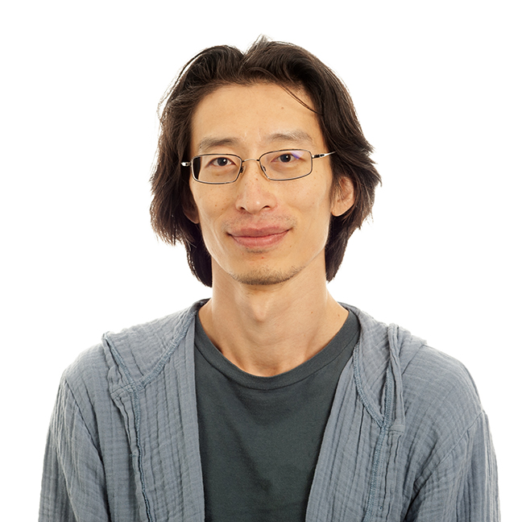

<!-- One .person card per member. Photos go in images/photos/ — square crops
     look best (they are shown as circles); other shapes are center-cropped.
     To add someone, copy a card and edit it. -->

## Lab members

::: {.people-grid}

::: {.person}
{fig-alt="Arthur Zhao"}

[Arthur Zhao]{.person-name}

[Principal Investigator]{.person-role}

[<arthurzhao@nd.edu>]{.person-email}
:::

<!-- Template:
::: {.person}
{fig-alt="First Last"}

[First Last]{.person-name}

[Role, e.g. PhD student, postdoc, staff scientist]{.person-role}
:::
-->

<!-- Empty frame for a future member. Keep it last: add new cards above. -->
::: {.person .person-open}
[]{.person-frame}

[This could be you]{.person-name}

[[See openings](openings.qmd)]{.person-role}
:::

:::

